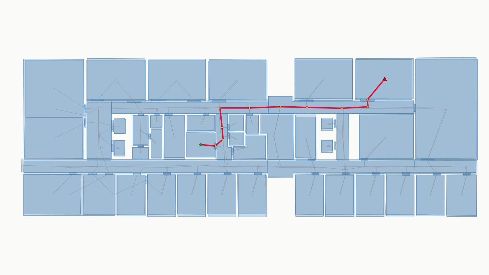

# pgrouting-for-indoorgml

Extract an IndoorGML dual-space network into [pgRouting](https://pgrouting.org/) and compute shortest paths — without modifying IndoorGML Core tables.

This project is based on the **IndoorGML 2.0 SQL encoding** (PostgreSQL/PostGIS), which maps the [OGC IndoorGML 2.0 Part 1 – Conceptual Model](https://docs.ogc.org/is/22-045r5/22-045r5.html) to relational tables. The schema and encoding follow the OGC IndoorGML SWG Part II SQL materials:

- [IndoorGML 2.0 SQL encoding (Part II / SQL)](https://github.com/opengeospatial/IndoorGML-SWG/tree/master/IndoorGML2/IndoorGML2_metanorma/Part%20II/SQL)
- [OGC IndoorGML 2.0 Part 1 – Conceptual Model (22-045r5)](https://docs.ogc.org/is/22-045r5/22-045r5.html)

## Example: PUN-IT shortest path

Dataset: [`data/sample-PUN-IT-2026-05-06.gml`](data/sample-PUN-IT-2026-05-06.gml) (dual-space layer `DS1`: 218 nodes, 229 edges).

| | |
|--|--|
| **Start** | `node_new_17` (green star) |
| **End** | `node_new_6` (red triangle) |
| **Cost mode** | `length` (edge geometry length) |
| **Result** | 12 hops · total cost ≈ **3268.94** |

```sql
SELECT * FROM routing.refresh_network('length', 'DS1');
SELECT * FROM routing.shortest_path('node_new_17', 'node_new_6');
```



Blue polygons = cell spaces · grey lines = dual network · red line = shortest path · yellow dots = path nodes.

Reproduce:

```bash
./scripts/setup_db.sh -d indoorgml_punit --recreate --demo
# or, if the database already exists:
./scripts/install.sh -d indoorgml_punit --demo
```

Open in QGIS: [`qgis/IndoorGML_PUN_IT_pgRouting.qgz`](qgis/IndoorGML_PUN_IT_pgRouting.qgz)

## Architecture

```text
data/*.gml  →  tools/import_gml.py  →  IndoorGML Node / Edge
                                            ↓
                                  routing.refresh_network()
                                            ↓
                                   node_map / edge_map
                                            ↓
                                  pgr_dijkstra (shortest_path)
                                            ↓
                            Route table  ·  QGIS views (path_params)
```

Topology comes from `Edge.connects` + cost — not from deprecated `pgr_createTopology`.

| Object | Role |
|--------|------|
| `routing.node_map` | Integer `vid` ↔ IndoorGML `NodeID` |
| `routing.edge_map` | `source` / `target` / `cost` for pgRouting |
| `routing.refresh_network()` | Rebuild maps (`length` or `weight`) |
| `routing.shortest_path()` | Dijkstra between two `NodeID`s |
| `routing.save_route()` | Write into IndoorGML `"Route"` |
| `routing.path_params` / `v_qgis_*` | QGIS start/end + path layers |

## Prerequisites

- PostgreSQL + PostGIS
- pgRouting ≥ 3.4 (tested with 3.8)
- Python 3.10+ (GML import only)

```bash
pip install -r requirements.txt
```

## Quick start

One-shot: create DB → IndoorGML schema → import PUN-IT → install routing → run demo:

```bash
cd pgrouting-for-indoorgml
./scripts/setup_db.sh -d indoorgml_punit --recreate --demo
```

Routing only (IndoorGML data already loaded):

```bash
./scripts/install.sh -d indoorgml_punit --refresh --demo
```

Or with `psql`:

```bash
psql -h localhost -U postgres -d indoorgml_punit -f sql/install.sql
psql -h localhost -U postgres -d indoorgml_punit -f sql/punit_shortest_path.sql
```

Manual steps:

```bash
psql -d indoorgml_punit -f sql/IndoorGML_core.sql
psql -d indoorgml_punit -f sql/IndoorGML_navi.sql
python3 tools/import_gml.py --db indoorgml_punit --no-schema
./scripts/install.sh -d indoorgml_punit --demo
```

## Usage

```sql
SELECT * FROM routing.refresh_network('length', 'DS1');
SELECT * FROM routing.shortest_path('node_new_17', 'node_new_6');
SELECT routing.save_route('route_demo_01', 'node_new_17', 'node_new_6');

-- QGIS path endpoints
SELECT * FROM routing.set_path_endpoints('node_new_17', 'node_new_6');
```

Cost modes: `length` (default, geometry length) · `weight` (`Edge.Weight`).

## Repository layout

```text
pgrouting-for-indoorgml/
├── data/sample-PUN-IT-2026-05-06.gml
├── docs/images/                  # README figures
├── sql/
│   ├── IndoorGML_core.sql        # IndoorGML Core DDL (apply first)
│   ├── IndoorGML_navi.sql        # IndoorGML Navigation DDL
│   ├── install.sql               # routing: core.sql + qgis.sql
│   ├── core.sql                  # routing schema + API
│   ├── qgis.sql                  # path_params + v_qgis_* views
│   └── punit_shortest_path.sql   # PUN-IT demo queries
├── scripts/
│   ├── setup_db.sh               # create DB + schema + import + routing
│   └── install.sh                # install / refresh routing only
├── tools/                        # GML → PostgreSQL importer
├── qgis/                         # QGIS project + render helper
├── requirements.txt
└── README.md
```

## Notes

- Undirected by default (`reverse_cost = cost`, `directed := false`).
- Multi-layer: omit the layer filter, or add interlayer edges before Dijkstra.
